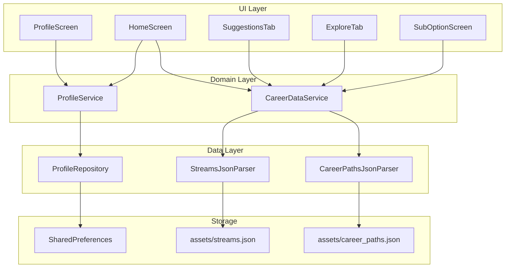
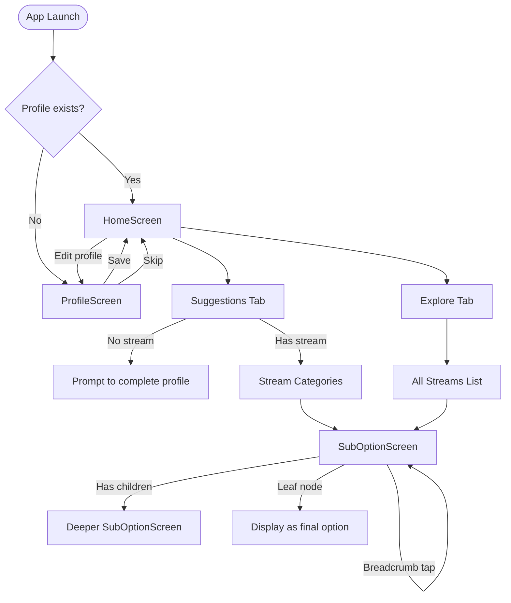

# Design Document: Career Path Guidance

## Overview

Career Path Guidance is a Flutter mobile application that helps 10+2 students explore career options through a hierarchical, offline-first experience. The app collects a minimal student profile (name and stream), then presents personalized career suggestions and a full explore view, both powered by local JSON data bundled with the app.

Phase 1 is entirely offline — no APIs, no remote database. Profile data is persisted via SharedPreferences, and career data is loaded from two local JSON asset files (`streams.json` and `career_paths.json`).

### Key Design Decisions

- **Offline-only architecture**: All data is bundled as assets. No network layer needed in Phase 1.
- **Two JSON files with ID-based mapping**: `streams.json` defines streams and their top-level categories; `career_paths.json` defines the full hierarchical tree of career nodes. They are linked by IDs.
- **SharedPreferences for profile**: Lightweight, synchronous-read persistence suitable for a small key-value profile.
- **Navigator-based drill-down**: Each Sub_Option_Screen is a new route pushed onto the Navigator stack, with breadcrumb state passed as route arguments.
- **Dedicated parser classes**: Separate parser/serializer classes for each JSON file to keep data loading testable and isolated.

## Architecture

The app follows a layered architecture with clear separation between data, domain logic, and UI.



### Navigation Flow



## Components and Interfaces

### Data Layer

#### `StreamsJsonParser`
Responsible for loading and parsing `streams.json` from assets.

```dart
class StreamsJsonParser {
  /// Parses raw JSON string into a list of Stream objects.
  List<StreamModel> parse(String jsonString);

  /// Serializes a list of Stream objects back to a JSON string.
  String serialize(List<StreamModel> streams);

  /// Loads and parses streams.json from Flutter assets.
  Future<List<StreamModel>> loadFromAssets();
}
```

#### `CareerPathsJsonParser`
Responsible for loading and parsing `career_paths.json` from assets.

```dart
class CareerPathsJsonParser {
  /// Parses raw JSON string into a map of CareerNode objects keyed by ID.
  Map<String, CareerNode> parse(String jsonString);

  /// Serializes a map of CareerNode objects back to a JSON string.
  String serialize(Map<String, CareerNode> nodes);

  /// Loads and parses career_paths.json from Flutter assets.
  Future<Map<String, CareerNode>> loadFromAssets();
}
```

#### `ProfileRepository`
Handles reading/writing profile data to SharedPreferences.

```dart
class ProfileRepository {
  /// Saves the student's name and stream to SharedPreferences.
  Future<void> saveProfile(String name, String stream);

  /// Reads the saved profile. Returns null if no profile exists.
  Future<ProfileData?> loadProfile();

  /// Checks whether a saved profile exists.
  Future<bool> hasProfile();
}
```

### Domain Layer

#### `ProfileService`
Orchestrates profile-related logic.

```dart
class ProfileService {
  final ProfileRepository _repository;

  /// Saves profile and returns success/failure.
  Future<bool> saveProfile(String name, String stream);

  /// Loads the current profile, or null if none.
  Future<ProfileData?> getProfile();

  /// Returns true if a profile has been saved previously.
  Future<bool> isProfileComplete();
}
```

#### `CareerDataService`
Provides career data to the UI layer.

```dart
class CareerDataService {
  final StreamsJsonParser _streamsParser;
  final CareerPathsJsonParser _careerPathsParser;

  /// Initializes by loading both JSON files. Call once at app start.
  Future<void> initialize();

  /// Returns all available streams.
  List<StreamModel> getAllStreams();

  /// Returns top-level career categories for a given stream ID.
  List<CareerNode> getCategoriesForStream(String streamId);

  /// Returns child career nodes for a given parent node ID.
  List<CareerNode> getChildrenOf(String nodeId);

  /// Returns a single career node by ID.
  CareerNode? getNodeById(String nodeId);
}
```

### UI Layer

#### `ProfileScreen`
- Text field for name input
- Stream selector (Science, Commerce, Art) — radio buttons or segmented control
- Save button and Skip button
- Pre-fills values when editing an existing profile

#### `HomeScreen`
- `TabBar` with two tabs: Suggestions and Explore
- App bar displays student name if profile exists
- Settings/edit icon to navigate back to ProfileScreen

#### `SuggestionsTab`
- If stream is set: displays top-level career categories for that stream as tappable cards
- If no stream: displays a prompt with a link to ProfileScreen

#### `ExploreTab`
- Displays all streams as tappable cards
- Tapping a stream navigates to SubOptionScreen with that stream's categories

#### `SubOptionScreen`
- Receives breadcrumb path and current node ID as route arguments
- Displays `Breadcrumb_Trail` at the top (tappable segments)
- Lists child career nodes as tappable items
- Leaf nodes displayed without navigation affordance
- Back button navigates to previous hierarchy level


## Data Models

### `StreamModel`

Represents a 10+2 education stream with its top-level career category references.

```dart
class StreamModel {
  final String id;       // Unique identifier, e.g., "science"
  final String name;     // Display name, e.g., "Science"
  final List<String> categoryIds; // IDs of top-level CareerNodes

  StreamModel({required this.id, required this.name, required this.categoryIds});

  factory StreamModel.fromJson(Map<String, dynamic> json);
  Map<String, dynamic> toJson();
}
```

### `CareerNode`

Represents a single node in the career path hierarchy.

```dart
class CareerNode {
  final String id;            // Unique identifier, e.g., "btech"
  final String name;          // Display name, e.g., "B.Tech"
  final String? parentId;     // Parent node ID, null for top-level nodes
  final List<String> childIds; // IDs of child CareerNodes, empty for leaf nodes

  CareerNode({
    required this.id,
    required this.name,
    this.parentId,
    this.childIds = const [],
  });

  bool get isLeaf => childIds.isEmpty;

  factory CareerNode.fromJson(Map<String, dynamic> json);
  Map<String, dynamic> toJson();
}
```

### `ProfileData`

Represents the student's saved profile.

```dart
class ProfileData {
  final String name;
  final String stream; // One of: "science", "commerce", "art"

  ProfileData({required this.name, required this.stream});
}
```

### `BreadcrumbEntry`

Represents a single segment in the breadcrumb trail.

```dart
class BreadcrumbEntry {
  final String nodeId;
  final String label;

  BreadcrumbEntry({required this.nodeId, required this.label});
}
```

### JSON File Structures

#### `assets/data/streams.json`

```json
{
  "streams": [
    {
      "id": "science",
      "name": "Science",
      "categoryIds": ["science_maths", "science_bio"]
    },
    {
      "id": "commerce",
      "name": "Commerce",
      "categoryIds": ["commerce_ca", "commerce_finance"]
    },
    {
      "id": "art",
      "name": "Art",
      "categoryIds": ["art_design", "art_media"]
    }
  ]
}
```

#### `assets/data/career_paths.json`

```json
{
  "nodes": [
    {
      "id": "science_maths",
      "name": "Maths",
      "parentId": null,
      "childIds": ["btech", "bsc_maths"]
    },
    {
      "id": "btech",
      "name": "B.Tech",
      "parentId": "science_maths",
      "childIds": ["btech_cs", "btech_mech"]
    },
    {
      "id": "btech_cs",
      "name": "Computer Science",
      "parentId": "btech",
      "childIds": []
    }
  ]
}
```

### SharedPreferences Keys

| Key | Type | Description |
|-----|------|-------------|
| `profile_name` | `String` | Student's name |
| `profile_stream` | `String` | Selected stream ID |

